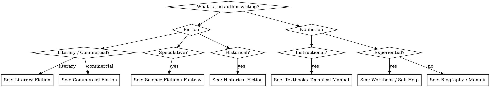

# Genre Craft

## Overview

Every genre has conventions that exist because readers come with specific expectations. Meeting those expectations is the floor; transcending them within their framework is the ceiling.

**Core principle:** Know the rules before you break them. Genre conventions are reader contracts.

## Genre Quick Reference

---

## Literary Fiction

**Reader contract:** Character depth, thematic resonance, prose quality. Plot serves character; resolution may be ambiguous.

**Core techniques:**
- Interiority: the reader lives inside the POV character's consciousness
- The prose is itself a layer of meaning — sentence rhythm, word choice, and image carry theme
- Endings earn ambiguity through earned complexity, not through abandoning resolution
- The "ordinary" is made strange; the strange is made ordinary
- Show the wound without naming it

**What literary fiction readers reject:**
- Convenient plot resolutions that don't arise from character
- Flat, functional prose
- Unearned sentimentality
- Protagonists who are passive observers with no interiority

**Structural note:** Literary fiction often uses the kishōtenketsu model or inverted three-act structure. The inciting incident may be subtle. The climax may be internal.

---

## Commercial / Genre Fiction (Mystery, Thriller, Romance)

**Reader contract:** Satisfying plot engine, genre-specific promise delivered, emotional payoff. Mystery readers want the crime solved. Romance readers want the central relationship consummated. Thriller readers want the protagonist to prevail.

**Core techniques:**
- Genre promise must be established in the opening pages (hooks)
- Pacing is faster than literary fiction — scenes end on hooks, chapters end on cliffhangers
- The genre promise must be honored: if it's a mystery, solve it; if it's a romance, resolve the relationship arc
- Subvert reader expectations within the genre framework — never subvert the genre promise itself

**What commercial fiction readers reject:**
- Slow openings
- Dead ends that don't pay off
- Genre promise broken (mystery with no satisfying solution, romance with no relationship resolution)
- Stakes that don't escalate

---

## Science Fiction

**Reader contract:** A scientifically (or technologically) coherent extrapolation of our world, with real human stakes. The "what if" must be taken seriously.

**Core techniques:**
- The SF premise must change something fundamental about how humans live, work, relate, or understand themselves
- Ground the unfamiliar in the familiar: describe alien or future phenomena through their effects on characters, not through technical description
- Hard SF: The science must be internally consistent even if not literally accurate
- Soft SF: The technology is a backdrop; focus is on social, political, or psychological extrapolation
- Avoid "As you know, Bob" exposition — find ways to dramatize world information
- The SF premise should create the story's central conflict, not just its setting

**Norms and tropes to be aware of:**
- The chosen one (often subverted in literary SF)
- The scientist protagonist who explains everything
- Technology as savior or destroyer (avoid making technology purely good or purely evil)
- First contact (establish clear rules for what the alien is/does and stay consistent)

**What SF readers reject:**
- Science that contradicts established SF conventions without explanation
- Technology that magically solves the central conflict
- Humans as stand-ins for modern-day positions without the extrapolation doing real work

---

## Fantasy

**Reader contract:** A world with different rules, fully realized, where the magic is internally consistent and the stakes are real.

**Core techniques:**
- Establish magic rules early — readers will test them
- Use magic costs to create tension (Sanderson's First Law: a writer can solve problems with magic only in proportion to how well the reader understands the magic)
- Ground the fantasy world in sensory detail — smells, textures, sounds make worlds feel real
- The fantasy elements should reflect or amplify the story's themes
- Epic fantasy: plot and world scale; the story earns its length
- Urban fantasy: the mundane world and the magical world in tension
- Grimdark: subverts fantasy idealism; moral ambiguity is the point — apply deliberately, not reflexively

**World-building priority:** See `novel-superpowers:world-building` for magic system design.

**What fantasy readers reject:**
- Magic that solves every problem without cost
- World-building that exists only to display the author's imagination without serving story
- Protagonists who are special because they're special (without earning it)

---

## Historical Fiction

**Reader contract:** Accurate period atmosphere and detail, with compelling human characters navigating real historical forces.

**Core techniques:**
- Research the period thoroughly — get the physical details right (clothing, food, transport, medicine)
- Research what people believed, feared, and hoped for — not just what they did
- Avoid modern psychology dressed in period costume: characters should hold period-appropriate worldviews (even when the author knows better)
- Historical events are backstory and pressure — they shape the characters' world but the story belongs to the characters
- Author's Notes: document deliberate liberties taken with historical record
- Avoid anachronistic language, concepts, and sensibilities

**What historical fiction readers reject:**
- Characters who think and speak like modern people
- Glaring historical inaccuracies without acknowledgment
- History as mere backdrop with no effect on character or plot
- The famous historical figure who exists only to cameo and validate the protagonist

---

## Biography and Memoir

**Reader contract:** True story, rendered with the craft of fiction, that illuminates something true about a life and by extension a larger human experience.

**Core techniques:**
- **Biography:** The subject's interiority must be established through documented evidence (letters, diaries, testimony) — never invented
- **Memoir:** The author is both narrator and character; the narrator knows more than the character did at the time, and that gap is a narrative tool
- The arc: biography and memoir need a narrative arc as much as fiction — what is the subject learning, losing, or becoming?
- Scene vs. summary: dramatize the key moments, summarize the transitional ones
- The emotional truth: what is the book really about beneath the events? What does this life mean?
- For memoir: protect living people appropriately; consider what must be disclosed

**What biography/memoir readers reject:**
- Hagiography (uncritical celebration)
- Lack of narrative arc — a series of events rather than a story
- Authorial intrusion that breaks the memoir voice
- Invented dialogue or interiority in biography (flag any reconstruction clearly)

---

## Self-Help and Personal Development

**Reader contract:** The reader will be transformed. They will finish the book with something they can apply to their life.

**Core techniques:**
- The book must deliver on its promise — if the title says "How to stop worrying," the framework must actually address worry
- Organize around transformation: where is the reader at the start, and where will they be at the end?
- Use story to illustrate principle — case studies and anecdotes make abstract frameworks concrete
- Repeat core principles deliberately — readers remember through repetition and variation
- Exercises: if the book includes exercises, they must be actionable and specific
- Voice: the author's credibility and warmth are structural elements — readers must trust and like you

**What self-help readers reject:**
- Promises made on the cover that aren't delivered in the book
- Abstract frameworks with no application path
- Stories that contradict the advice
- Condescension

---

## Workbooks

**Reader contract:** Active transformation through structured exercises. The reader is the protagonist.

**Core techniques:**
- Every section has a clear outcome: what will the reader know or have done by the end?
- Exercises must be specific and completable — no exercise that ends in "reflect on this"
- Scaffold from simple to complex: early exercises build capacity for later ones
- White space and visual structure matter — the reader is writing in the book
- Provide examples: show what a completed exercise looks like
- Progress indicators: readers need to feel movement

**Structure:**
- Opening: what this workbook delivers and how to use it
- Modules: each module = one capability, one transformation step
- Each module: brief concept → example → exercise → reflection/review
- Closing: what the reader now has, and where to go next

---

## Textbooks and Educational Works

**Reader contract:** Mastery. The reader will understand and be able to apply the subject matter.

**Core techniques:**
- Learning objectives per chapter (what the reader will be able to do after reading)
- Prerequisite sequencing: never require knowledge the reader doesn't yet have
- Concept → Example → Application → Assessment is the standard pedagogical loop
- Multiple modes of explanation: diagrams, worked examples, and prose reach different learners
- Glossary terms: introduce and define technical vocabulary explicitly before using it
- Review questions and exercises at the end of each chapter
- Consistent voice and format across chapters

**What textbook readers reject:**
- Concepts assumed without explanation
- Worked examples that skip steps
- Exercises that test topics not covered in the chapter
- Inconsistent terminology (calling the same concept two names)

---

## Technical Manuals

**Reader contract:** The reader can complete a specific task. Clarity over elegance.

**Core techniques:**
- Task-oriented structure: organize by what the user needs to do, not by how the system is built
- Numbered steps for procedures: one action per step
- Warnings and notes: flag dangerous, important, or optional information visually
- Screenshots, diagrams, examples: show exactly what the user will see
- Consistent terminology: use the same term for the same thing throughout — never synonyms
- Scannability: readers do not read manuals linearly; headers, numbered steps, and visual hierarchy are essential
- Tested procedures: every step must be verified by actually performing it

**What manual readers reject:**
- Passive voice that obscures who does what
- Assumed knowledge not established in a prerequisites section
- Steps that skip details the reader actually needs
- Inconsistent terminology
