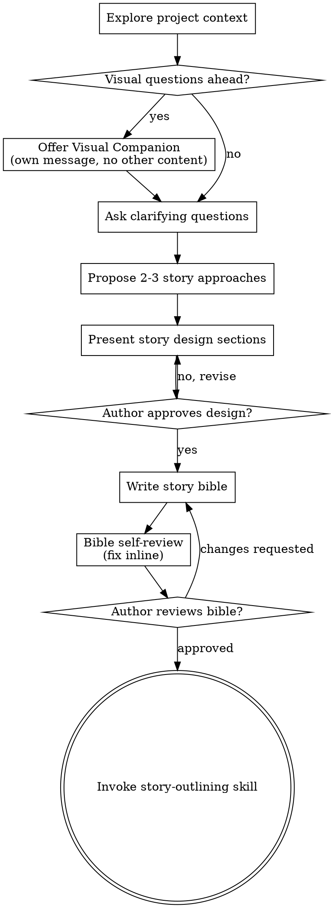

# Story Brainstorming — Concept Into Story Bible

Help turn story ideas into fully formed narrative designs through natural collaborative dialogue.

Start by understanding the current project context, then ask questions one at a time to refine the concept. Once you understand what's being built, present the story design and get author approval.

<HARD-GATE>
Do NOT invoke any drafting skill, write any story content, scaffold any chapter structure, or take any writing action until you have presented a story design and the author has approved it. This applies to EVERY project regardless of perceived simplicity.
</HARD-GATE>

## Anti-Pattern: "This Is Too Simple To Need A Story Bible"

Every writing project goes through this process. A short story, a flash fiction piece, a single chapter — all of them. "Simple" projects are where unexamined assumptions cause the most wasted writing. The design can be short (a few sentences for truly simple pieces), but you MUST present it and get approval.

## Checklist

You MUST create a task for each of these items and complete them in order:

1. **Explore project context** — check existing chapters, notes, character files, previous bibles, recent changes
2. **Offer visual companion** (if the story involves visual questions — world maps, character relationships, timeline diagrams) — this is its own message, not combined with a clarifying question
3. **Ask clarifying questions** — one at a time, understand genre, audience, length, themes, tone, POV, structure
4. **Propose 2-3 story approaches** — with trade-offs and your recommendation
5. **Present story design** — in sections scaled to complexity, get author approval after each section
6. **Write story bible** — save to `docs/novel-superpowers/bibles/YYYY-MM-DD-<title>-bible.md` and commit
7. **Story bible self-review** — check for placeholder characters, contradictory plot points, ambiguous rules, scope sprawl
8. **Author reviews written bible** — ask author to review before proceeding
9. **Transition to outlining** — invoke story-outlining skill to create the chapter breakdown

## Process Flow

**The terminal state is invoking story-outlining.** Do NOT jump into writing prose, generating chapters, or invking any other skill. The ONLY skill you invoke after brainstorming is story-outlining.

## The Process

**Understanding the idea:**

- Check out the current project state first (existing chapters, character notes, world documents, recent writes)
- Before asking detailed questions, assess scope: if the request spans multiple independent story arcs, volumes, or series entries, flag this immediately. Don't spend questions refining details of a project that needs to be decomposed first.
- If the project is too large for a single bible, help the author decompose into sub-projects: what are the independent story units, how do they relate, what order should they be written? Then brainstorm the first unit through the normal design flow.
- For appropriately-scoped projects, ask questions one at a time to refine the concept
- Prefer multiple choice questions when possible
- Only one question per message — if a topic needs more exploration, break it into multiple questions
- Focus on understanding: genre, audience, tone, themes, POV structure, intended length, emotional core

**Story questions to explore (pick the most relevant, not all):**

- Genre and subgenre (literary fiction, sci-fi, fantasy, historical fiction, biography, memoir, self-help, workbook, textbook, technical manual)
- Target reader and their expectations for this genre
- Point of view (first person, third limited, omniscient, second person, multi-POV)
- Intended length (flash fiction, short story, novella, novel, series)
- Central conflict and stakes
- Protagonist's want vs. need (what they chase vs. what they truly require)
- World rules: what is different from our world, and what stays the same?
- Tone (dark, comedic, hopeful, bittersweet, satirical, earnest)
- Themes (the question the story is interrogating)
- Emotional experience the author wants readers to leave with

**Exploring approaches:**

- Propose 2-3 different structural or conceptual approaches with trade-offs
- Present options conversationally with your recommendation and reasoning
- Lead with your recommended option and explain why
- Examples: three-act vs. episodic vs. in medias res; single POV vs. ensemble; linear vs. non-linear timeline

**Presenting the design:**

- Once you understand what's being written, present the story design
- Scale each section to its complexity
- Ask after each section whether it looks right so far
- Cover: premise, narrative structure, main characters and their arcs, world/setting, central conflict, themes, tone
- Be ready to revise if something doesn't resonate

**Design for coherence:**

- Every character, scene, and world element should serve the story's central question
- For each major character: what do they want, what do they need, how do they change?
- Can someone understand what the story is about without reading it? If not, the premise needs work.
- Shorter, focused narratives are often stronger — YAGNI applies to story: remove elements that don't earn their place

## After the Design

**Story Bible:**

Write the validated design to `docs/novel-superpowers/bibles/YYYY-MM-DD-<title>-bible.md`

A story bible includes:
- **Premise** — one or two sentences describing the story
- **Genre & Audience** — genre, subgenre, target reader
- **Structure** — act structure, POV approach, intended length
- **Characters** — protagonist, antagonist, key supporting cast: name, role, want, need, arc
- **World** — setting, rules, history relevant to the story
- **Central Conflict** — external and internal
- **Themes** — the questions the story interrogates
- **Tone & Voice** — emotional register, narrative distance, style notes
- **Story Beats** — the major turning points (optional for short work)

Commit the bible to the repository.

**Bible Self-Review:**

After writing the bible, examine it with fresh eyes:

1. **Placeholder scan:** Any unnamed characters listed as "TBD," vague plot descriptions, or incomplete world rules? Fix them.
2. **Internal consistency:** Do character motivations match their actions? Does the world's rules allow for the plot?
3. **Scope check:** Is this focused enough for a single outline, or does it need decomposition?
4. **Ambiguity check:** Could any story beat be interpreted two different ways? Pick one interpretation and make it explicit.

Fix any issues inline.

**Author Review Gate:**

After self-review, ask the author to review the written bible before proceeding:

> "Story bible written and committed to `<path>`. Please review it and let me know if you want to make any changes before we start building the outline."

Wait for the author's response. Only proceed once approved.

**Outlining:**

- Invoke the story-outlining skill to create a detailed chapter and scene breakdown
- Do NOT invoke any other skill. story-outlining is the next step.

## Key Principles

- **One question at a time** — Don't overwhelm with multiple questions
- **Multiple choice preferred** — Easier to answer than open-ended when possible
- **YAGNI ruthlessly** — Remove unnecessary characters, subplots, and world elements from all designs
- **Explore alternatives** — Always propose 2-3 structural approaches before settling
- **Incremental validation** — Present design sections, get approval before moving on
- **Be flexible** — Go back and clarify when something doesn't resonate

## Genre Notes

When the story is nonfiction, biography, memoir, workbook, textbook, or technical manual, adapt the design questions accordingly:

- **Biography/memoir:** Who is the subject? What is the narrative arc of their life being told? What emotional truth is the author after? What research or source material exists?
- **Self-help/workbook:** What transformation does the reader undergo? What exercises, frameworks, or systems does the book teach? How is progress measured?
- **Textbook/technical manual:** Who is the learner? What do they know coming in, and what will they know leaving? How is the material sequenced? What are the learning objectives per chapter?

The story-outlining skill adapts to these nonfiction forms automatically.
