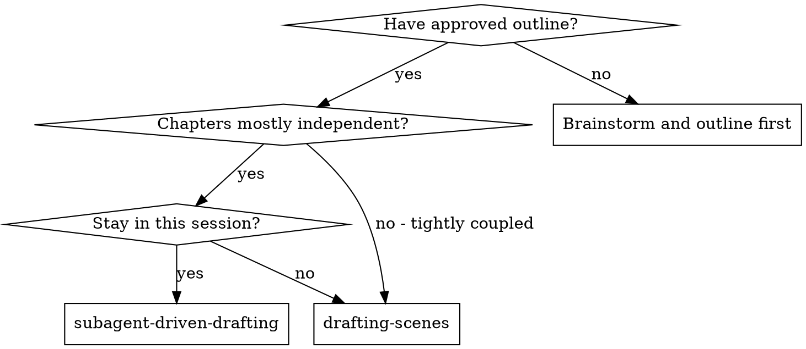
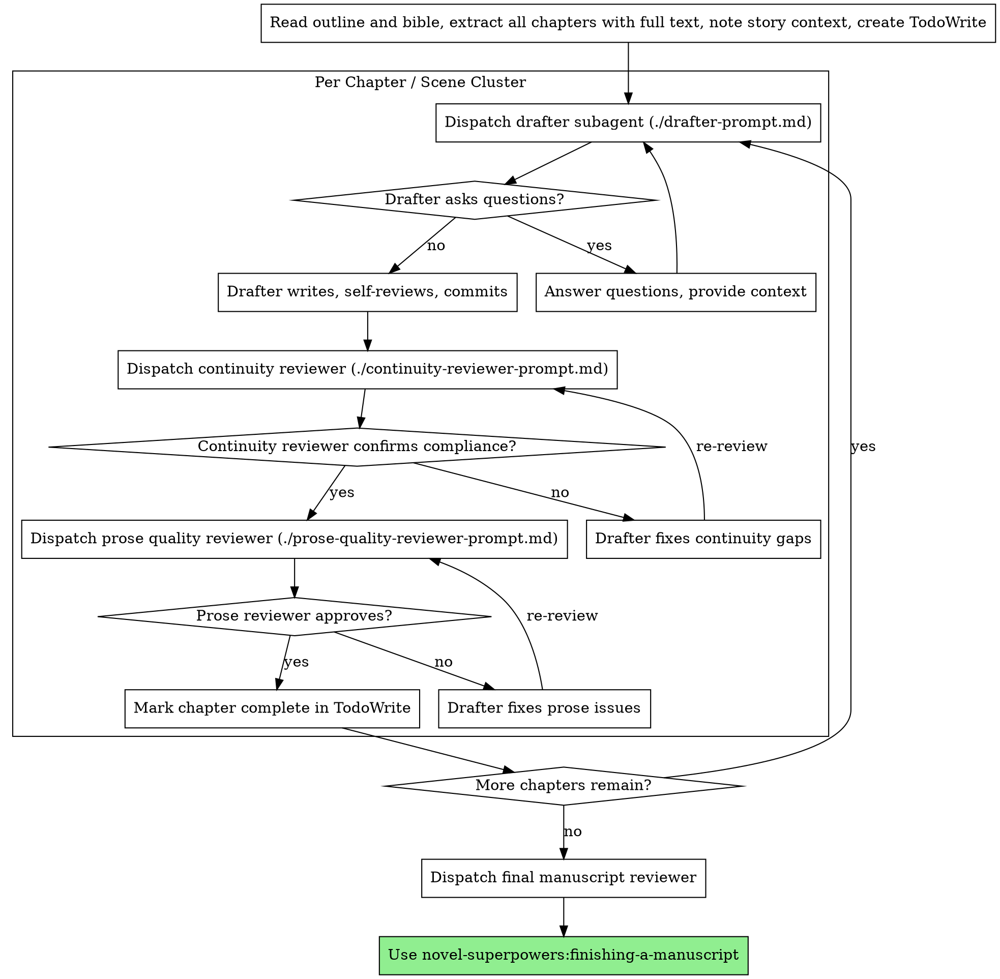

# Subagent-Driven Drafting

Execute story outline by dispatching a fresh subagent per chapter or scene cluster, with two-stage review after each: continuity compliance first, then prose quality.

**Why subagents:** You delegate drafting to specialized agents with isolated context. By precisely crafting their instructions and scene-specific context, you ensure they stay focused on that chapter. They should never inherit your session's context or history — you construct exactly what they need. This preserves your own context for coordination and continuity tracking.

**Core principle:** Fresh subagent per chapter + two-stage review (continuity then prose) = consistent, high-quality drafts with clean handoffs between chapters.

## When to Use



## The Process



## Model Selection

Use the most capable model available for drafting — story writing requires nuance, voice consistency, and emotional intelligence that mechanical tasks don't.

**All drafting tasks:** Use the most capable available model. Story quality is the goal.

**Continuity review:** Standard model is fine — this is pattern-matching against established facts.

**Prose quality review:** Most capable model — this requires literary judgment.

## Handling Drafter Status

Drafter subagents report one of four statuses. Handle each appropriately:

**DONE:** Proceed to continuity review.

**DONE_WITH_CONCERNS:** The drafter completed the chapter but flagged creative doubts. Read the concerns before proceeding. If concerns are about outline conflicts or character motivation, address them before review. If they're stylistic observations, note them and proceed to review.

**NEEDS_CONTEXT:** The drafter needs information not provided — missing world detail, character backstory, earlier chapter content. Provide the missing context and re-dispatch.

**BLOCKED:** The drafter cannot complete the chapter. Assess the blocker:
1. If it's a context problem, provide more context and re-dispatch
2. If the outline entry is insufficient, provide a more detailed scene brief and re-dispatch
3. If the outline itself is structurally broken, escalate to the author
4. If the chapter calls for research not yet done, gather it first

**Never** ignore an escalation or force the same subagent to retry without changes.

## Prompt Templates

- `./drafter-prompt.md` — Dispatch drafter subagent
- `./continuity-reviewer-prompt.md` — Dispatch continuity compliance reviewer
- `./prose-quality-reviewer-prompt.md` — Dispatch prose quality reviewer

## Pre-Dispatch Context Package

Every drafter subagent needs exactly this context — not more, not less:

1. **Story bible summary** (3-5 sentences: premise, world, main characters, tone)
2. **Full outline entry** for this chapter (copied verbatim — do not paraphrase)
3. **Continuity log** — facts established in all prior chapters that this chapter must honor
4. **Previous chapter's final paragraph** — for smooth narrative handoff
5. **Author style notes** (voice, tense, POV, any explicit preferences)

**Never** make the drafter read the full outline file or prior chapters — you provide exactly what they need.

## Continuity Log Management

You maintain a running continuity log as the coordinator. After each chapter:

1. Read the completed chapter
2. Extract new facts established: character states, world changes, timeline position, objects gained or lost, relationships changed, secrets revealed
3. Add them to your continuity log
4. Include this log in every subsequent drafter's context package

**Format:**
```
CONTINUITY LOG — [Title]

Chapter 1:
- Elara has a map she received from the merchant Bren
- The city of Veth is three days' ride east
- Elara does not know her brother is alive

Chapter 2:
- Elara's map was stolen by the Tollmen at the border crossing
- She now knows the Tollmen work for Lord Cassin
```

## Red Flags

**Never:**
- Skip continuity review (it comes before prose review — always)
- Start prose quality review before continuity is confirmed ✅
- Allow drafter to invent world facts not in the bible without flagging them
- Let drafter contradict established continuity without fixing it
- Dispatch multiple drafters simultaneously for the same chapter
- Skip the pre-dispatch context package (drafter needs story context to write in voice)
- Move to next chapter while either review has open issues
- Accept "close enough" on continuity (reviewer found issues = not done)

**If drafter asks questions:**
- Answer clearly before letting them draft
- Provide context from the continuity log
- Don't rush them into writing

**If reviewer finds issues:**
- Same drafter fixes them (maintains voice consistency)
- Reviewer reviews again
- Repeat until approved

## Integration

**Required workflow skills:**
- **novel-superpowers:story-outlining** — Creates the outline this skill executes
- **novel-superpowers:continuity-verification** — Full continuity verification process
- **novel-superpowers:finishing-a-manuscript** — Completes manuscript after all chapters

**Alternative workflow:**
- **novel-superpowers:drafting-scenes** — Single-session inline drafting without subagents
