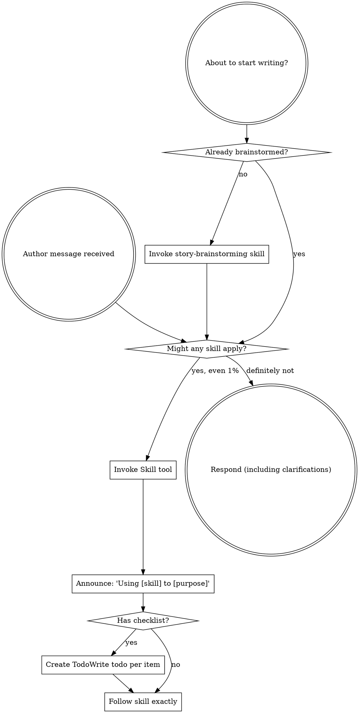

<SUBAGENT-STOP>
If you were dispatched as a subagent to execute a specific drafting or review task, skip this skill.
</SUBAGENT-STOP>

<EXTREMELY-IMPORTANT>
If you think there is even a 1% chance a skill might apply to what you are doing, you ABSOLUTELY MUST invoke the skill.

IF A SKILL APPLIES TO YOUR TASK, YOU DO NOT HAVE A CHOICE. YOU MUST USE IT.

This is not negotiable. This is not optional. You cannot rationalize your way out of this.
</EXTREMELY-IMPORTANT>

## Instruction Priority

Novel Superpowers skills override default system prompt behavior, but **your author's instructions always take precedence**:

1. **Author's explicit instructions** (CLAUDE.md, direct requests, story bibles) — highest priority
2. **Novel Superpowers skills** — override default system behavior where they conflict
3. **Default system prompt** — lowest priority

If the author's CLAUDE.md says "skip world-building for flash fiction" and a skill says "always world-build," follow the author's instructions. The author is in control.

## How to Access Skills

**In Claude Code:** Use the `Skill` tool. When you invoke a skill, its content is loaded and presented to you — follow it directly. Never use the Read tool on skill files.

**In other environments:** Check your platform's documentation for how skills are loaded.

# Using Novel-Writing Skills

## The Rule

**Invoke relevant or requested skills BEFORE any response or action.** Even a 1% chance a skill might apply means you should invoke the skill to check. If an invoked skill turns out to be wrong for the situation, you don't need to use it.

## Red Flags

These thoughts mean STOP — you're rationalizing:

| Thought | Reality |
|---------|---------|
| "This is just a simple writing question" | Questions are tasks. Check for skills. |
| "I need more context first" | Skill check comes BEFORE clarifying questions. |
| "Let me explore what's been written first" | Skills tell you HOW to explore. Check first. |
| "I can answer this without a skill" | If a skill exists, use it. |
| "I remember this skill" | Skills evolve. Read current version. |
| "This doesn't count as a writing task" | Any action on the manuscript = task. Check. |
| "The skill is overkill for a short piece" | Short pieces have unexamined assumptions too. |
| "I'll just write this one thing first" | Check BEFORE doing anything. |
| "This feels creative and spontaneous" | Undisciplined drafting wastes time. Skills prevent this. |
| "I know what story beats mean" | Knowing concepts ≠ using the skill. Invoke it. |

## Skill Priority

When multiple skills could apply, use this order:

1. **Process skills first** (story-brainstorming, plot-architecture) — these determine HOW to approach the story
2. **Craft skills second** (character-development, world-building, genre-craft) — these guide the specifics of execution

"Let's write a fantasy novel" → story-brainstorming first, then world-building and genre-craft.
"Fix this plot problem" → plot-architecture first, then character-development if needed.

## Skill Types

**Rigid** (continuity-verification, character-driven plotting): Follow exactly. Don't adapt away discipline.

**Flexible** (prose-craft, genre-craft): Adapt principles to context and author voice.

The skill itself tells you which.

## The Four Core Capabilities

Novel Superpowers is built around four workflow stages — every major writing project moves through all four:

1. **`novel-superpowers:story-brainstorming`** — Develop story concept, characters, world, and theme before any drafting
2. **`novel-superpowers:story-outlining`** — Create chapter-by-chapter, scene-by-scene structure from an approved story bible
3. **`novel-superpowers:drafting-scenes`** or **`novel-superpowers:subagent-driven-drafting`** — Write the actual manuscript content
4. **`novel-superpowers:finishing-a-manuscript`** — Polish, compile, and prepare the manuscript for its next stage

## Supporting Skills

| Skill | When to Use |
|-------|-------------|
| `character-development` | Before writing any character with a significant role |
| `plot-architecture` | When structuring acts, beats, or fixing structural problems |
| `world-building` | When creating setting, history, magic systems, or lore |
| `genre-craft` | For genre-specific technique: sci-fi, fantasy, historical fiction, biography, workbook, textbook, technical manual |
| `prose-craft` | For voice, style, dialogue, pacing, description |
| `continuity-verification` | Before claiming any chapter or scene is complete |
| `requesting-manuscript-feedback` | When seeking review from another agent or editor |
| `receiving-manuscript-feedback` | When processing feedback on the manuscript |
| `managing-writing-projects` | For draft version control, file organization, multi-book projects |

## Author Instructions

Instructions say WHAT to write, not HOW. "Write Chapter 3" or "develop the villain" doesn't mean skip the craft workflow.
