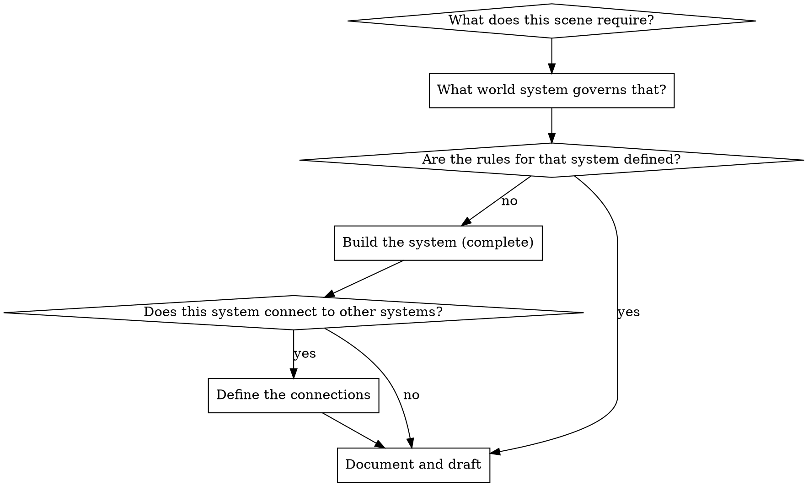

# World-Building

## Overview

A world that feels real is built from coherent systems, not from accumulation of cool details.

**Core principle:** Build only what the story needs — but build it completely.

**The world-builder's trap:** Inventing fascinating world detail that never affects the story. Avoid it.

## When to Use

**Always before:**
- Writing a scene that depends on world rules not yet established
- Developing a magic system, technology, political structure, or cultural practice
- Setting a scene in a location that hasn't been described
- Writing dialogue that assumes history the reader doesn't know

**Use ESPECIALLY when:**
- Building secondary-world fantasy or science fiction (world rules don't exist yet)
- Writing historical fiction (real-world rules must be researched and accurate)
- The story involves multiple nations, factions, or power structures
- Magic, technology, or special abilities have specific rules that affect plot

## The World-Building Principle

**Build from story need outward, not from world detail inward.**

Start with: what does the story need? Then build only that — but build it with internal consistency.



## World Systems

Build each system that the story requires. For each system, answer the questions below.

### Geography and Place

- What does this location look, feel, sound, and smell like?
- What is the climate and what does it demand of the people who live there?
- What natural resources does this place have or lack, and how does that shape its culture?
- What are the travel distances between key locations, and what does travel cost?
- What is the geography's strategic importance in the story's conflict?

### History

- What events in the past created the present situation?
- What do the characters know about this history, and what have they been told is false?
- What historical tensions are still unresolved and driving present conflict?
- What are the myths and legends, and how much truth is in them?

### Culture and Society

- What do people in this culture value most? What do they fear?
- What are the social hierarchies, and how rigid are they?
- What are the rituals, customs, and taboos?
- What does everyday life look like for someone without power in this society?
- How does gender, class, race, or other identity categories operate?

### Political Structure and Power

- Who holds power, and how did they get it?
- What are the mechanisms of power (military, economic, religious, magical)?
- Who wants to overthrow or change the power structure, and why?
- What laws exist, and who enforces them?
- What does corruption look like in this system?

### Magic Systems (Fantasy)

**Hard magic (rules-based):**
- What can it do? What can it explicitly NOT do?
- What is the cost of using it? (Fatigue, lifespan, sacrifice, resource)
- Who can use it, and why them and not others?
- Where does it come from? (Innate talent, training, artifacts, divine gift, technology)
- What happens when it goes wrong?

**Soft magic (mystery-based):**
- What does it feel like to the characters?
- What are the consistent observable effects?
- What are its limits — what has it never been able to do?
- How does it create wonder rather than solving problems?

**The Sanderson Corollaries:**
- An author's ability to use magic to solve a problem is directly proportional to how well the reader understands it
- Limitations are more interesting than powers
- The cost defines the magic

### Technology and Economics (Sci-Fi and Historical)

- What technology exists, and at what level?
- What is scarce, and who controls the scarce things?
- How does trade work, and what are the dominant economic relationships?
- What does the technology make possible that wouldn't be possible without it?
- What does the technology make impossible that was previously possible?

### Religion and Belief

- What do people believe about the nature of the universe, life, and death?
- Is the religion demonstrably true in this world? If so, what does that change?
- How does religious authority interact with political authority?
- What are the heresies, and what happens to heretics?

## Parallel World-Building (When Systems Are Independent)

When multiple world systems need development and they don't depend on each other, dispatch parallel subagents — one per system:

```
Subagent 1 → Develop the magic system
Subagent 2 → Develop the political structure
Subagent 3 → Develop the geography and key locations
```

After all complete:
- Review each system for internal consistency
- Check for conflicts between systems (does the magic system undermine the political structure?)
- Resolve conflicts
- Integrate into the story bible

## World-Building Document

Save to: `docs/novel-superpowers/world/[world-name]-worldbook.md` or individual system files under `docs/novel-superpowers/world/[system-name].md`

**Format:**
```markdown
# [World Name] — [System Name]

## Overview
[2-3 sentences describing this system]

## Rules
[The specific, enumerated rules of this system]

## Limits
[What this system explicitly cannot do]

## Costs
[What using or interacting with this system costs]

## Story Relevance
[How this system directly affects the plot and characters]

## Open Questions
[Things deliberately left undefined — mark these intentionally]
```

## The World-Building Trap

**Warning signs you've fallen into the trap:**

- You know the capital city's founding date but haven't written a single scene
- You've built a magic system that doesn't affect any plot point
- Your world notes are longer than your manuscript
- You're adding world detail because it's interesting, not because a scene needs it
- You feel reluctant to start drafting because "the world isn't finished yet"

**The world is never finished. Start drafting.**

World-build to serve the story. When you have enough to write the next scene, write the scene. Build more world when the next scene requires it.

## Historical Fiction Adaptation

For historical fiction, world-building becomes research:

- What is accurate to the period, and what have you deliberately altered?
- What do characters of this era believe, know, and have access to?
- What anachronisms would break the reader's immersion?
- Document your research sources in the worldbook for continuity checking
- Clearly flag deliberate historical liberties in your notes

The same "build from story need outward" principle applies: research what the scene requires, not everything about the era.
